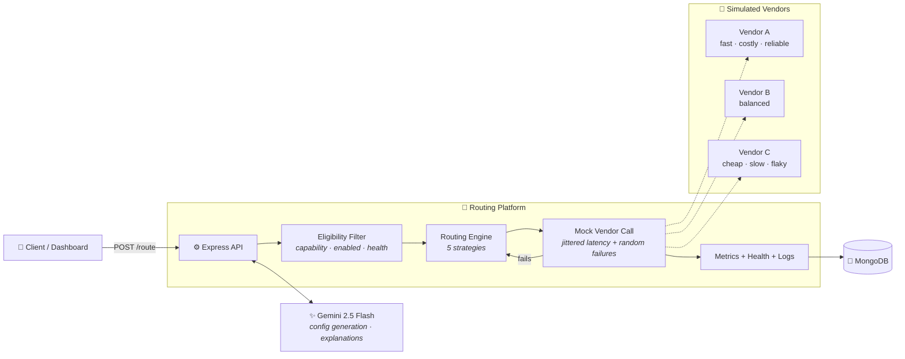

<div align="center">


# ⚡ Intelligent Vendor Routing Platform

**One API. Many vendors. Zero juggling.**

A middleware platform that sits between your application and multiple third-party
vendors (PAN verification, OCR, SMS, KYC…) and automatically routes every request
to the best vendor — based on cost, latency, priority, and live health — with
automatic failover and AI-powered explanations.

<br/>

[](https://intelligent-vendor-routing-platform.vercel.app/index.html)
[](https://intelligent-vendor-routing-platform.onrender.com/logsave-hub)


</div>

---

## 🔗 Live Deployments

| | Link | Hosted on |
|---|---|---|
| 🖥️ **Frontend Dashboard** | **[intelligent-vendor-routing-platform.vercel.app](https://intelligent-vendor-routing-platform.vercel.app/index.html)** | Vercel |
| ⚙️ **Backend API** | **[intelligent-vendor-routing-platform.onrender.com](https://intelligent-vendor-routing-platform.onrender.com/)** | Render |

> 💤 The backend runs on Render's free tier and sleeps when idle — the **first
> request after a while can take 30–60 seconds** to wake it up. After that,
> everything is fast.

---

## 📚 Documentation Map

Every part of the project has its own detailed guide — click through:

| 📄 Document | What's inside |
|---|---|
| 🔧 [**Backend README**](./backend/README.md) | Architecture, setup, env vars, folder structure, running the API |
| 🎨 [**Frontend README**](./frontend/README.md) | Every dashboard page, the API client, config, running & deploying |
| 📡 [**API Reference**](./docs/API.md) | Every endpoint with request/response examples, cURL, local + deployed URLs |
| 🧠 [**Routing Engine Deep-Dive**](./docs/ROUTING_ENGINE.md) | All 5 strategies explained with algorithms, edge cases & examples |
| 🧪 [**Testing Guide**](./docs/TESTING.md) | Unit, integration & coverage testing — what's covered and how to run it |
| 🔁 [**CI/CD Pipeline**](./docs/CICD-PIPELINE.md) | GitHub Actions workflows, test gating, Render/Vercel deploy hooks |

---

## 💡 The Problem → The Solution

Modern applications rarely rely on a single vendor for a capability. Each
vendor differs in **cost**, **latency**, **reliability**, and **rate limits** —
and your application ends up juggling multiple SDKs, retry logic, and failover
rules.

**This platform replaces all of that with one call:**

```jsonc
POST /api/v1/route
{
  "capability": "PAN_VERIFICATION",
  "payload": { "pan": "ABCDE1234F", "name": "Rahul Sharma" },
  "requirements": { "preferLowCost": true }
}
```

The platform filters eligible vendors, applies a routing strategy, calls the
vendor, fails over automatically if it errors, records metrics, updates health,
logs the decision — and returns one clean response with a human-readable
**reason** for why that vendor was chosen.

---

## 🏗️ Architecture



---

## ✨ Features

| | Feature | Description |
|---|---|---|
| 🗂️ | **Vendor Management** | Full CRUD — priority, weight, cost, latency, capabilities, rate limit, failure rate |
| 🎯 | **5 Routing Strategies** | Priority · Weighted · Lowest Cost · Lowest Latency · Failover |
| 🔀 | **Single Route API** | `POST /route` — one entry point for every vendor call |
| 🛟 | **Automatic Failover** | Failed vendor? The next-best one is retried automatically — client never notices |
| 📊 | **Live Metrics** | Requests, success/failure, avg latency, error rate & availability per vendor |
| ❤️‍🩹 | **Health Monitoring** | Vendors auto-classified `HEALTHY → WARNING → OFFLINE` from rolling error rate |
| 📜 | **Decision Logs** | Every routing decision persisted with strategy, reason, latency & attempts |
| ✨ | **AI Config Generator** | Plain English → structured routing config via Gemini |
| 🗣️ | **AI Route Explainer** | "Why was Vendor B chosen?" answered in plain English for any log |
| 📈 | **Live Dashboard** | Real-time ticker, charts (Chart.js), health pills & a built-in route tester |

---

## 🎯 Routing Strategies at a Glance

| Strategy | Picks the vendor with… | Best for |
|---|---|---|
| `PRIORITY` *(default)* | lowest priority number (rank 1 wins) | reliability-first routing |
| `WEIGHTED` | probability ∝ weight (70/20/10 → ~70%/20%/10%) | traffic splitting, canary rollouts |
| `LOWEST_COST` | smallest cost per request | bulk, non-urgent workloads |
| `LOWEST_LATENCY` | smallest avg latency (optional `maxLatency` ceiling) | user-facing, time-critical flows |
| `FAILOVER` *(automatic)* | next-best untried vendor after a failure | always on — the safety net |

➡️ Full algorithms, edge cases and worked examples in the
[**Routing Engine Deep-Dive**](./docs/ROUTING_ENGINE.md).

---

## 🖥️ The Dashboard

| Page | What you can do |
|---|---|
| **Dashboard** | Live stats, scrolling routing ticker, vendor health snapshot |
| **Vendors** | Create / edit / delete vendors · fire live test requests through the router |
| **Metrics** | Latency & success/failure charts per vendor + detailed table |
| **Routing Logs** | Browse every decision · click **Explain** for a Gemini-written explanation |

---

## 🧰 Tech Stack

**Backend:** Node.js · TypeScript · Express.js · Mongoose (MongoDB) · Gemini 2.5 Flash
**Frontend:** HTML · CSS · Vanilla JavaScript · Chart.js *(no framework, no build step)*
**Testing:** Jest · ts-jest · Supertest · mongodb-memory-server
**DevOps:** GitHub Actions · Render (API) · Vercel (frontend)

*Intentionally no auth, microservices, Docker, Redis or Kafka — scoped as a
readable, demonstrable university final-year project.*

---

## 📁 Repository Structure

```
.
├── backend/            # Express + TypeScript API
│   ├── src/            # config · models · services · controllers · routes · middlewares
│   ├── tests/          # unit + integration tests (Jest, Supertest, in-memory Mongo)
│   └── README.md       # → backend guide
├── frontend/           # Static dashboard (HTML/CSS/JS + Chart.js)
│   ├── js/  css/
│   └── README.md       # → frontend guide
├── docs/
│   ├── API.md          # → full API reference
│   ├── ROUTING_ENGINE.md
│   ├── TESTING.md
│   └── CICD-PIPELINE.md
├── LICENSE
└── README.md           # ← you are here
```

---

## 🚀 Quick Start (Local)

**Prerequisites:** Node.js ≥ 18 · MongoDB (local or Atlas) · Gemini API key

```bash
# 1️⃣ Clone
git clone https://github.com/Adamkoda2306/Intelligent-Vendor-Routing-Platform.git
cd Intelligent-Vendor-Routing-Platform

# 2️⃣ Backend
cd backend
npm install
cp .env.example .env        # add your MONGO_URI + GEMINI_API_KEY
npm run seed                # seeds Vendor A, B, C
npm run dev                 # API on http://localhost:3000

# 3️⃣ Frontend (new terminal)
cd ../frontend
npx serve .                 # or VS Code Live Server
# → set API_BASE_URL in js/api.js to http://localhost:3000/api/v1
```

Then open the frontend URL, go to **Vendors → Test the Router**, and watch the
dashboard light up. Detailed setup lives in the
[backend](./backend/README.md) and [frontend](./frontend/README.md) READMEs.

---

## 🧪 Testing & 🔁 CI/CD

```bash
cd backend
npm run test:unit           # ⚡ fast, fully mocked service tests
npm run test:integration    # 🌐 real HTTP against in-memory MongoDB
npm run test:coverage       # 📊 full suite + HTML coverage report
```

Every push touching `backend/**` runs **three parallel GitHub Actions jobs**
(unit · integration · coverage). Only when **all three pass on `main`** does
the pipeline trigger the Render deploy hook — broken code can be pushed, but
it can never reach production:

```
push → ┌ Unit Tests ────────┐
       ├ Integration Tests ─┼──▶ all green? ──▶ 🚀 Deploy to Render
       └ Coverage Report ───┘        │
                                     └─ any red? ──▶ ⛔ no deploy
```

Frontend pushes touching `frontend/**` trigger a Vercel deploy the same way.
Details: [**Testing Guide**](./docs/TESTING.md) ·
[**CI/CD Pipeline**](./docs/CICD-PIPELINE.md).

---

## 🔮 Future Improvements

Authentication & role-based dashboard access · persisting AI-generated configs
directly into vendor weights · enforcing `rateLimitPerMin` · WebSocket/SSE live
updates instead of polling · real vendor integrations behind the same `/route`
interface · finishing the AI Config dashboard page.

---

## 📄 License

Released under the [MIT License](./LICENSE).

<div align="center">
<br/>

⭐ *If you find this project useful, consider giving it a star!*

</div>